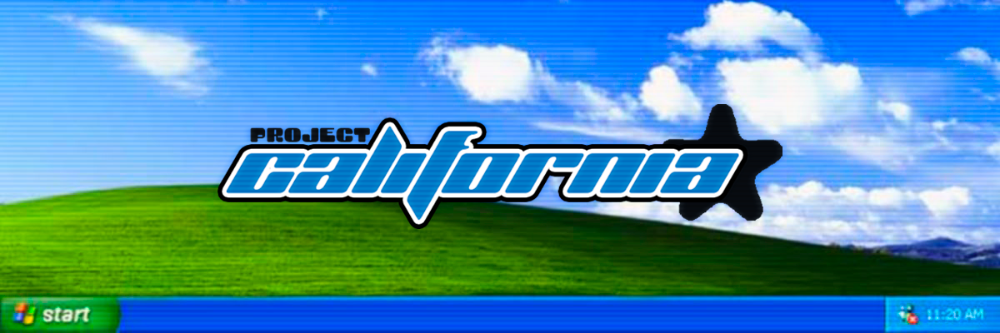
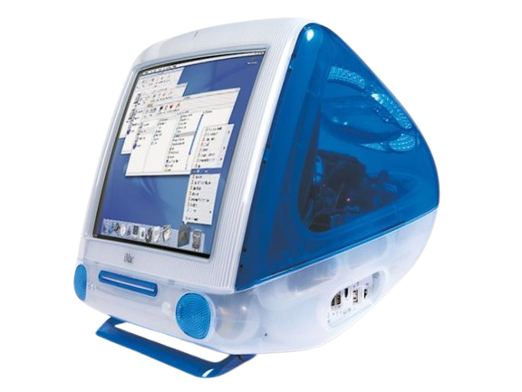

  
    
  
    
  

    
    
    
  

 

<table border="0" cellpadding="0" cellspacing="0" style="border: none;">
  <tr style="border: none;">
    <td valign="middle" style="border: none;">
      

        
      

       
      Este repositório foi criado para guardar a minha evolução na <strong>Linguagem de Programação Java</strong>. 
      Este repositório só existe por conta da matéria de <strong>Linguagem de Programação</strong> da <strong>Fatec Ipiranga</strong>.
        
       
      O Wallpaper do Windows XP veio de uma paisagem da Califórnia, como homenagem ao primeiro SO utilizado na minha vida.
    </td>
    <td valign="middle" align="center" width="250" style="border: none;">
      
    </td>
  </tr>
</table>

 

  

  

     
    
      
    
  

 

  
    
  

