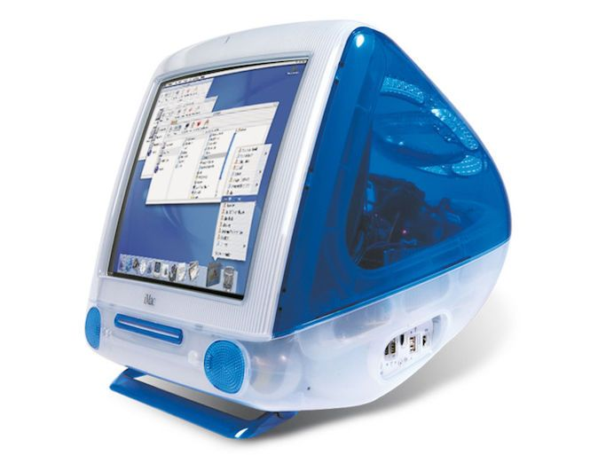

  

        <h2 style="font-family: 'Comic Sans MS', cursive; color: #498de2;">Project California</h2>

    

        
        
        
    

 

 

    
    

        

            <h4 style="font-family: 'Comic Sans MS', sans-serif; color: #498de2;">O que é este repositório?</h4>
        

        

            
Este repositório foi criado para ser guardar a minha evolução na <strong>Linguagem de Programação Java</strong>. Este repositório só existe por conta da matéria de <strong>Linguagem de Programação</strong> da <strong>Fatec Ipiranga</strong> <strong style="font-family: 'Comic Sans MS'; color: #498de2;">Porque Project California?</strong> O Wallpaper do Windows XP veio de uma paisagem da california, como homenagem ao primeiro SO utilizado na minha vida.

        

    

 

    
    

    <h4 style="font-family: 'Comic Sans MS', sans-serif; color: #498de2;">Linguagem presente neste repositório</h4>
    

        
    

#

  

 

